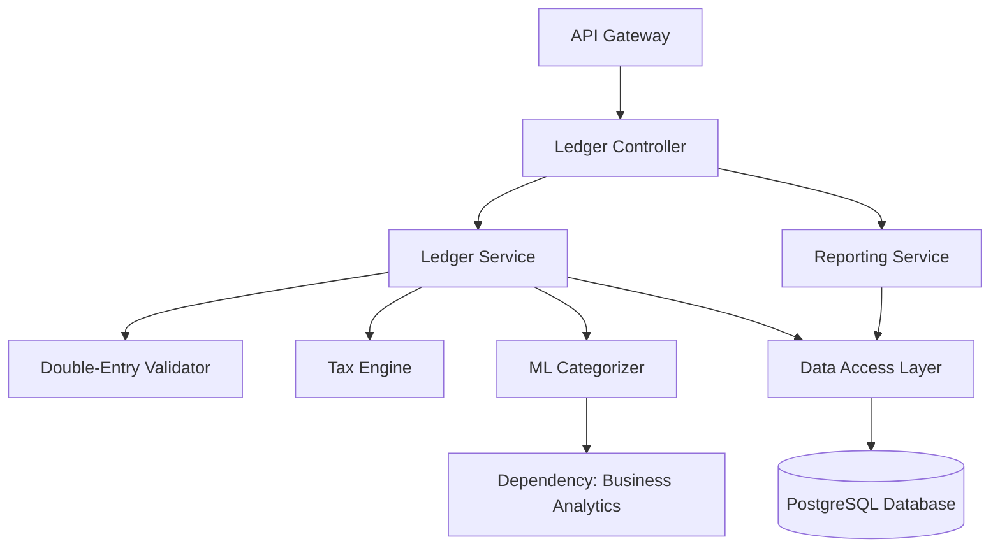

500-TPS-LEDGER

# Technical Product Specification: Ledger & Finance Module

## 1. Module Overview

### 1.1 Purpose
The **Ledger & Finance Module** serves as the immutable financial backbone of the application. Its primary purpose is to enforce professional accounting standards through rigid logic, ensuring that all financial data is accurate, audit-ready, and compliant with regional tax laws. Unlike flexible data stores, this module implements a strict "no-rollback" policy to maintain the integrity of the "books," preventing the "messy" financial states common in micro-businesses. It automates technical accounting tasks such as tax calculation and expense categorization to allow business owners to focus on operations while keeping external accountants satisfied with standardized reporting.

### 1.2 Scope
**In Scope:**
*   **General Ledger (GL):** Management of the Chart of Accounts and processing of double-entry journal entries.
*   **Immutability Engine:** Logic to prevent modification of posted entries; corrections are handled via reversing entries only.
*   **Tax Engine:** Automated calculation of taxes based on configurable regional settings and franchise rules.
*   **Bank Reconciliation:** Ingestion of bank feeds and matching against ledger entries.
*   **Reporting:** Generation of standard financial statements (P&L, Balance Sheet).
*   **ML Categorization:** Automated classification of expenses based on historical data and transaction descriptions.
*   **Audit Logging:** Comprehensive tracking of every action taken within the module.

**Out of Scope:**
*   **Invoicing UI:** Creation of invoices (handled by upstream modules; this module only records the financial impact).
*   **Payment Processing:** Handling of credit card transactions (handled by Monetization/Payment Gateway).
*   **Payroll Calculation:** Detailed payroll breakdown (this module records the aggregate journal entry).

### 1.3 Assumptions and Constraints
*   **Technical Stack Assumption:** Given the requirement for strict data integrity and ACID compliance, this specification assumes the use of a Relational Database Management System (e.g., PostgreSQL) and a strongly typed backend language (e.g., TypeScript/Node.js or Java).
*   **Currency:** The system must handle multi-currency logic or default to a base currency with high-precision decimal storage (no floating-point errors).
*   **Double-Entry Standard:** The system enforces that Total Debits must equal Total Credits for every transaction.
*   **Dependency:** The module relies on the *Business Analytics Module* for advanced visualization, though it provides the raw data.

### 1.4 Version History
*   **Version:** 1.0
*   **Date:** 2023-10-27

---

## 2. Requirements

### 2.1 Functional Requirements

| ID | Requirement Description | Data Models / Ref |
| :--- | :--- | :--- |
| **LEDGER-FR-001** | The system must maintain an **Immutable General Ledger** where posted `JournalEntry` records cannot be updated or deleted. Corrections must be made via a new reversing entry. | `JournalEntry` |
| **LEDGER-FR-002** | The system must validate that every `JournalEntry` is balanced (Sum of Debits = Sum of Credits) before committing to the database. | `JournalEntry`, `JournalLine` |
| **LEDGER-FR-003** | The system must support a standardized `ChartOfAccounts` structure configurable by industry type. | `ChartOfAccounts` |
| **LEDGER-FR-004** | The system must automatically calculate tax liabilities based on `TaxRule` configurations associated with the transaction's region. | `TaxRule` |
| **LEDGER-FR-005** | The system must ingest bank transaction feeds and provide a reconciliation interface to match them against existing ledger entries. | `BankFeedItem` |
| **LEDGER-FR-006** | The system must utilize Machine Learning to suggest or automatically assign expense categories (GL Accounts) to incoming bank transactions. | `MLModel` |
| **LEDGER-FR-007** | The system must generate real-time "One-click" financial reports including Profit & Loss and Balance Sheet. | `FinancialReport` |
| **LEDGER-FR-008** | The system must provide a read-only view specifically for the "External Accountant" user role. | `UserRole` |
| **LEDGER-FR-009** | The system must export financial data in standard formats (CSV, XML) compatible with external tax filing software. | N/A |

### 2.2 Non-Functional Requirements

| ID | Requirement Description | Category |
| :--- | :--- | :--- |
| **LEDGER-NFR-001** | **Data Integrity:** All financial calculations must be performed using arbitrary-precision decimal arithmetic (e.g., `Decimal` type), never floating-point. | Reliability |
| **LEDGER-NFR-002** | **Auditability:** Every write operation to the ledger must generate an immutable `AuditLog` entry containing timestamp, user ID, and previous state hash. | Security |
| **LEDGER-NFR-003** | **Performance:** Financial report generation for a fiscal year with < 100,000 transactions must complete in under 2 seconds. | Performance |
| **LEDGER-NFR-004** | **Concurrency:** The ledger must handle concurrent postings without creating race conditions or unbalanced states (ACID compliance required). | Scalability |

### 2.3 Acceptance Criteria
*   A user cannot edit a posted transaction; they can only void/reverse it.
*   A P&L report generated matches the sum of all income and expense accounts for the period.
*   The system successfully categorizes 80% of recurring bank feed expenses automatically via ML.
*   An External Accountant can log in and view reports but cannot post entries.

---

## 3. Use Cases to be Supported

### UC-001: Post Financial Transaction
**Actors**: Micro-business Owner, Upstream System (via API)
**Preconditions**: Chart of Accounts is configured.
**Steps**:
1.  Actor submits transaction data (e.g., "Invoice Created" or "Expense Paid").
2.  **Module** validates that the transaction date is within an open fiscal period.
3.  **Module** determines the Debit and Credit accounts based on transaction type.
4.  **Module** calculates applicable tax based on `TaxRule`.
5.  **Module** verifies Debits = Credits.
6.  **Module** persists the `JournalEntry` and `JournalLines`.
7.  **Module** updates current account balances.
**Postconditions**: Ledger is updated; Audit trail is created.
**Exception Flows**: If Debits != Credits, return `400 Bad Request` (Unbalanced Entry).

### UC-002: Bank Feed Reconciliation with ML
**Actors**: Micro-business Owner
**Preconditions**: Bank feed is connected; un-reconciled bank transactions exist.
**Steps**:
1.  User views "Bank Feed" dashboard.
2.  **Module** displays un-reconciled bank transactions.
3.  **Module** (ML Engine) analyzes transaction description (e.g., "Starbucks") and suggests "Meals & Entertainment" account.
4.  User confirms the suggestion or selects a different account.
5.  **Module** creates a `JournalEntry` recording the expense.
6.  **Module** marks the bank transaction as Reconciled.
**Postconditions**: Expense is recorded in GL; ML model trains on the user's confirmation.

### UC-003: Generate External Accountant Report
**Actors**: External Accountant
**Preconditions**: User has `External Accountant` role.
**Steps**:
1.  Actor requests "Balance Sheet" for the previous fiscal year.
2.  **Module** aggregates all asset, liability, and equity account balances up to the end date.
3.  **Module** formats the data into a standard accounting view.
4.  **Module** returns the report PDF or view.
**Postconditions**: Report is displayed. No data is modified.

---

## 4. High-Level Architecture

### 4.1 Component Diagram
The module follows a layered architecture to ensure separation of concerns and strict logic enforcement.



*   **Ledger Service:** Core logic for posting entries and enforcing immutability.
*   **Tax Engine:** Sub-component for calculating tax lines on entries.
*   **ML Categorizer:** Async service that processes descriptions to suggest accounts.

### 4.2 Dependencies
*   **Internal:**
    *   **Business Analytics Module:** Used to feed historical data for advanced trend analysis and potentially sourced for ML training data.
    *   **Monetization Module:** The Ledger pushes billing data (usage) to Monetization, and Monetization pushes revenue entries to Ledger.
*   **External:**
    *   **Tax Rate Provider API:** (Optional) To fetch real-time regional tax rates.
    *   **Bank Plaid/Yodlee Integration:** For fetching bank feed data.

### 4.3 Data Flow
1.  **Ingest:** Transaction data arrives from upstream modules or user input.
2.  **Validate:** System checks strict typing, account existence, and debit/credit balance.
3.  **Enrich:** Tax Engine appends tax lines if applicable.
4.  **Persist:** Data is written to `JournalEntry` and `JournalLine` tables in a single transaction.
5.  **Propagate:** Event `ledger.entry.posted` is fired.
6.  **Analyze:** ML Engine reads the description asynchronously to update categorization models.

### 4.4 Integration Points
*   **Input:** REST API for other modules to post financial events (`POST /api/v1/ledger/entries`).
*   **Output:**
    *   Data feed to **Monetization Module** for usage-based billing calculations.
    *   Export feature (JSON/CSV) for third-party tax software.
*   **Webhooks:** Notifies external systems when a Fiscal Period is closed.

---

## 5. Interfaces and APIs

### 5.1 Input/Output Interfaces

#### POST /api/v1/ledger/entries
Creates a new immutable journal entry.
*   **Auth:** Requires `owner` or `system` role. `External Accountant` cannot access.
*   **Request Schema:**
    ```json
    {
      "date": "2023-10-27",
      "description": "Service Revenue",
      "lines": [
        { "accountId": "ACC-101", "debit": 100.00, "credit": 0 },
        { "accountId": "ACC-400", "debit": 0, "credit": 100.00 }
      ],
      "metadata": { "sourceModule": "INVOICING", "sourceId": "INV-001" }
    }
    ```

#### GET /api/v1/ledger/reports/balance-sheet
Retrieves the Balance Sheet.
*   **Auth:** `owner`, `accountant`.
*   **Query Params:** `endDate`, `format` (json/pdf/csv).

#### POST /api/v1/ledger/categorize
Invokes the ML engine to suggest a category for a raw string.
*   **Request:** `{ "description": "Uber Trip", "amount": 25.50 }`
*   **Response:** `{ "suggestedAccountId": "EXP-TRAVEL", "confidence": 0.92 }`

### 5.2 Events and Callbacks
*   `ledger.entry.created`: Published when a journal entry is successfully committed.
*   `ledger.account.created`: Published when the Chart of Accounts is modified.

### 5.3 Pseudo-Code Examples

**Critical Operation: Posting an Entry**
```javascript
function postJournalEntry(entryRequest) {
  // 1. Validate Structure
  if (!entryRequest.lines || entryRequest.lines.length < 2) {
    throw new ValidationError("Entry must have at least 2 lines");
  }

  // 2. Calculate Balance (Using high-precision math)
  let totalDebit = Decimal(0);
  let totalCredit = Decimal(0);

  foreach (line in entryRequest.lines) {
    totalDebit = totalDebit.plus(line.debit);
    totalCredit = totalCredit.plus(line.credit);
    
    // Validate Account Exists
    if (!accountExists(line.accountId)) throw new Error("Invalid Account");
  }

  // 3. Strict Balance Check
  if (!totalDebit.equals(totalCredit)) {
    throw new UnbalancedEntryError(`Debits ${totalDebit} != Credits ${totalCredit}`);
  }

  // 4. ACID Transaction
  database.transaction(() => {
    const entryId = database.insert("JournalEntry", {
      date: entryRequest.date,
      description: entryRequest.description,
      locked: true // Immutable flag
    });
    
    foreach (line in entryRequest.lines) {
      database.insert("JournalLine", { ...line, entryId: entryId });
    }
    
    auditLog.record("ENTRY_POST", entryId);
  });
  
  return { success: true, id: entryId };
}
```

---

## 6. Data Models and Structures

### 6.1 Core Entities

**JournalEntry**
*   `id`: UUID, Primary Key
*   `date`: ISO Date, Transaction date
*   `description`: String, Narrative of transaction
*   `is_posted`: Boolean, Finalized status
*   `source_module`: String, Origin (e.g., "MANUAL", "INVOICE")

**JournalLine**
*   `id`: UUID, Primary Key
*   `journal_entry_id`: UUID, FK to JournalEntry
*   `account_id`: UUID, FK to ChartOfAccounts
*   `debit`: Decimal(19,4), Debit amount
*   `credit`: Decimal(19,4), Credit amount

**ChartOfAccounts**
*   `id`: UUID, Primary Key
*   `code`: String, Human readable code (e.g., "1000")
*   `name`: String, Account Name
*   `type`: Enum (ASSET, LIABILITY, EQUITY, REVENUE, EXPENSE)
*   `tax_code_ref`: String, Link to TaxRule

**TaxRule**
*   `id`: UUID
*   `region_code`: String (e.g., "US-CA")
*   `rate`: Decimal
*   `description`: String

### 6.2 Database Schemas (Relational/SQL)

```sql
CREATE TABLE journal_entries (
    id UUID PRIMARY KEY DEFAULT gen_random_uuid(),
    transaction_date DATE NOT NULL,
    description TEXT,
    posted_at TIMESTAMP DEFAULT NOW(),
    is_reversed BOOLEAN DEFAULT FALSE,
    CONSTRAINT immutable_check CHECK (posted_at IS NOT NULL) -- Logic handled in app layer usually
);

CREATE TABLE journal_lines (
    id UUID PRIMARY KEY,
    journal_entry_id UUID REFERENCES journal_entries(id),
    account_id UUID REFERENCES chart_of_accounts(id),
    debit DECIMAL(19, 4) DEFAULT 0,
    credit DECIMAL(19, 4) DEFAULT 0
);

CREATE INDEX idx_lines_entry ON journal_lines(journal_entry_id);
CREATE INDEX idx_lines_account ON journal_lines(account_id);
```

### 6.3 Data Storage Approach
*   **Primary Storage:** Relational Database (PostgreSQL) is mandated for ACID compliance and complex joins required for reporting.
*   **Audit Storage:** Append-only table or separate immutable log service for audit trails.

### 6.4 Data Transformations
*   **Currency Normalization:** All amounts stored in base currency. If multi-currency is enabled, a separate `exchange_rate` and `original_currency_amount` column is added to `JournalEntry`.

---

## 7. Detailed Logic and Algorithms

### 7.1 Key Processes
*   **Immutability Enforcement:** The application layer must reject any `UPDATE` or `DELETE` SQL commands against `journal_entries` or `journal_lines` once the `posted_at` timestamp is set.
*   **Reversal Logic:** To "edit" an entry, the system creates a clone of the original entry with Debits and Credits swapped, links it to the original via `original_entry_id`, and then prompts the user to create a new, correct entry.

### 7.2 Algorithms
*   **ML Expense Categorization:**
    1.  Tokenize transaction description (remove stop words, numbers).
    2.  Check for exact string matches in `UserHistory`.
    3.  If no match, use Naive Bayes or similar lightweight classifier trained on global dataset to predict `account_id`.
    4.  Return top 3 suggestions sorted by confidence score.

### 7.3 Pseudo-Code for Reconciliation
```javascript
function reconcileBankTransaction(bankTx, journalEntry) {
  // Exact Match
  if (bankTx.amount == journalEntry.totalAmount && 
      bankTx.date == journalEntry.date) {
      
      markReconciled(bankTx.id, journalEntry.id);
      return "MATCHED";
  }
  
  // Fuzzy Match (Date within 3 days)
  if (bankTx.amount == journalEntry.totalAmount && 
      dateDiff(bankTx.date, journalEntry.date) <= 3) {
      
      return "POTENTIAL_MATCH";
  }
  
  return "NO_MATCH";
}
```

### 7.4 Edge Cases and Boundary Conditions
*   **Fiscal Year Crossover:** Transactions posted on the boundary of a fiscal year must be handled carefully regarding Retained Earnings calculation.
*   **Zero-Value Entries:** Entries with 0.00 value should generally be rejected unless specific metadata markers require them.
*   **Rounding Errors:** When splitting taxes across multiple lines, the sum of parts must equal the total. Any remainder (e.g., $0.01) is allocated to the largest line item.

---

## 8. Error Handling and Logging

### 8.1 Types of Errors
*   **Validation Errors (400):** Unbalanced entries, invalid account codes, future dates (if restricted).
*   **Conflict Errors (409):** Attempting to post to a closed fiscal period.
*   **System Errors (500):** Database connection failure, Tax API timeout.

### 8.2 Error Handling Strategies
*   **Transactional Rollback:** If any part of a multi-line journal entry fails validation or persistence, the entire transaction is rolled back. No partial data is ever stored.
*   **Tax API Fallback:** If the external tax rate service is down, use the last cached rate and flag the entry with `tax_status: "ESTIMATED"` for later review.

### 8.3 Logging Requirements
*   **Audit Log:** Log sensitive actions (Create Entry, Close Period, Export Data).
    *   Format: `[TIMESTAMP] [USER_ID] [ACTION] [RESOURCE_ID] [OLD_VAL] [NEW_VAL]`
*   **Application Log:** Log errors and warnings. Do not log PII or financial totals in plain text in application logs to prevent leakage.

### 8.4 Monitoring and Alerts
*   **Metric:** `ledger.unbalanced_attempts` (Count). High count indicates a bug in upstream modules.
*   **Metric:** `ledger.api.latency`. Alert if > 2 seconds.

---

## 9. Security Considerations

### 9.1 Threat Model
*   **Internal Fraud:** A user altering historical records to hide theft.
*   **Data Leakage:** Unauthorized access to P&L data by non-owners.
*   **Injection:** SQL injection via transaction descriptions.

### 9.2 Security Mitigations
*   **Immutability:** Database permissions should ideally restrict `UPDATE/DELETE` on ledger tables even for the application user, if possible (using DB-level rules).
*   **Input Sanitization:** Strict type checking on all monetary inputs. Escape all string inputs.
*   **Encryption:** Data at rest (TDE) and in transit (TLS 1.3).

### 9.3 Compliance
*   **Tax Compliance:** The system generates data structures compatible with standard tax filing requirements.
*   **Audit:** The system maintains a complete audit trail to satisfy "Audit-Readiness" requirements.

### 9.4 Access Controls
*   **Micro-business Owner:** Read/Write access. Can post entries, view reports, manage settings.
*   **External Accountant:** Read-Only access. Can view reports and drill down into ledgers. Cannot create or modify entries.
*   **System (API):** Write-only (mostly). Can post entries from other modules.

---

## 10. References and Appendices

### 10.1 Related Documents
*   [Module Definition: Ledger & Finance Module]
*   [Business Analytics Module Specification]

### 10.2 Glossary
*   **GL (General Ledger):** The master set of accounts that summarize all transactions.
*   **Double-Entry:** Accounting system where every entry has a corresponding opposite entry (Debit/Credit).
*   **Reversing Entry:** A journal entry made to cancel out the effect of a previous entry.

### 10.3 Appendices
**Appendix A: Sample Chart of Accounts Structure**
*   1000 - Assets
    *   1100 - Cash
    *   1200 - Accounts Receivable
*   2000 - Liabilities
    *   2100 - Accounts Payable
*   3000 - Equity
*   4000 - Revenue
*   5000 - Expenses