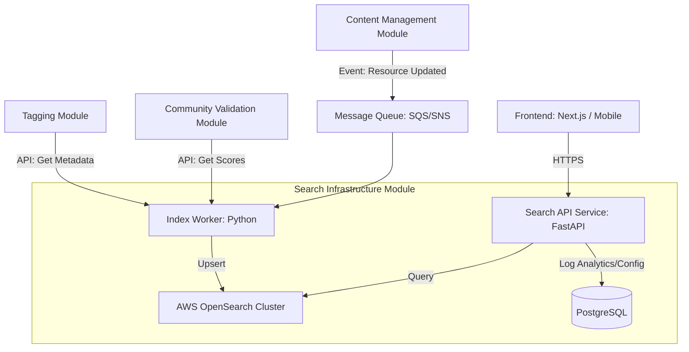

# 500-TPS-SEARCH

## 1. Module Overview

### 1.1 Purpose
The Search Infrastructure Module provides a high-performance, scalable, and relevant full-text search engine for the platform. It enables Educators to discover resources quickly through multi-language support, faceted filtering, and intelligent ranking algorithms. The module integrates community validation scores and user preferences to ensure the most high-quality and relevant content appears at the top of results. It abstracts the complexity of AWS OpenSearch/Elasticsearch interactions behind a clean Python FastAPI interface.

### 1.2 Scope
**Included:**
*   Management of AWS OpenSearch clusters, indices, mappings, and analyzers.
*   Ingestion and indexing pipelines for resources from the Content Management Module.
*   Public Search API for full-text queries, autocomplete, and faceting.
*   Relevance ranking logic incorporating metadata, recency, and community validation scores.
*   Search analytics and logging.
*   Synonym and query expansion management.

**Excluded:**
*   The actual storage of master content data (handled by Content Management Module).
*   User authentication (handled by Auth Module), though user context is used for personalization.
*   UI rendering logic (handled by Frontend/Mobile apps), though data structures are provided.

### 1.3 Assumptions and Constraints
*   **Infrastructure:** The underlying search engine will be AWS OpenSearch Service (managed Elasticsearch).
*   **Data Consistency:** There may be a slight eventual consistency delay (milliseconds to seconds) between content updates and search index availability.
*   **Language Support:** Initial configuration supports English and Spanish, with architecture extensible to other languages.
*   **Dependency:** The module relies on the Content Management Module publishing events for data synchronization.

### 1.4 Version History
*   **v1.0** - 2023-10-27 - Initial Specification Creation

---

## 2. Requirements

### 2.1 Functional Requirements

| ID | Requirement Description | Data Model / Ref |
| :--- | :--- | :--- |
| **SRCH-FR-001** | The system must index resources from the Content Management Module, including title, description, tags, and content body. | `SearchIndex` |
| **SRCH-FR-002** | The system must support full-text search with stemming, stop-word removal, and multi-language analysis (English, Spanish). | `SearchQuery` |
| **SRCH-FR-003** | The system must provide faceted filtering by tags, language, content type, validation score, and recency. | `SearchResult` |
| **SRCH-FR-004** | The search ranking algorithm must weigh results based on text matching (60%), community validation score (20%), recency (10%), and download counts (10%). | `SearchIndex` |
| **SRCH-FR-005** | The system must provide "type-ahead" autocomplete suggestions based on indexed tags and resource titles after 3 characters are typed. | `SearchQuery` |
| **SRCH-FR-006** | The system must support administrator-configured synonyms to expand queries (e.g., "math" searches for "mathematics"). | `Synonym` |
| **SRCH-FR-007** | The system must log search analytics, including query terms, zero-result queries, and result click-through rates (CTR). | `SearchAnalytics` |
| **SRCH-FR-008** | The system must highlight matching terms in the returned result snippets. | `SearchResult` |
| **SRCH-FR-009** | The system must allow personalized re-ranking based on the authenticated user's profile interests if available. | `SearchQuery` |
| **SRCH-FR-010** | The system must support bulk re-indexing without downtime (using aliases/blue-green indexing). | `SearchIndex` |

### 2.2 Non-Functional Requirements

| ID | Requirement Description |
| :--- | :--- |
| **SRCH-NFR-001** | **Latency:** Search queries must return results in under 200ms for the 95th percentile of requests. |
| **SRCH-NFR-002** | **Availability:** The search service must maintain 99.9% availability via AWS OpenSearch Multi-AZ deployment. |
| **SRCH-NFR-003** | **Scalability:** The system must support scaling to 10 million indexed documents and 500 concurrent queries per second. |
| **SRCH-NFR-004** | **Freshness:** Updates to content must be reflected in the search index within 5 seconds of the publish event. |
| **SRCH-NFR-005** | **Security:** Access to the OpenSearch cluster must be restricted to the internal VPC and the Search API service. |

### 2.3 Acceptance Criteria
*   Users can search for a resource by partial title and see relevant results.
*   Filtering by "High Validation Score" removes resources with low community scores.
*   Admin-defined synonyms (e.g., "exam" -> "test") function correctly in search.
*   Search analytics are persisted to PostgreSQL for reporting.
*   API handles invalid query parameters gracefully with 400 Bad Request.

---

## 3. Use Cases to be Supported

### UC-001: Educator Searches for Resources
**Actors**: Educator (User)
**Preconditions**: User is on the Search Interface; Resources are indexed.
**Steps**:
1.  User types "algebra lesson" into the search bar.
2.  Frontend calls `GET /search/suggest` as user types (SRCH-FR-005).
3.  User selects a suggestion or presses Enter.
4.  Frontend calls `GET /search` with the query string.
5.  Module processes query, applies synonyms, executes OpenSearch query (SRCH-FR-002).
6.  Module returns ranked list of results with facets (SRCH-FR-003, SRCH-FR-004).
7.  User clicks a filter (e.g., "Video").
8.  Module updates results based on active filters.
**Postconditions**: User sees filtered, ranked results.
**Exception Flows**:
*   *Zero Results*: Return empty list with "Did you mean?" suggestions or broad match fallback.

### UC-002: System Indexes New Content
**Actors**: Content Management Module (System), Search Infrastructure Module
**Preconditions**: A resource is published or updated in the CMS.
**Steps**:
1.  Content Management Module publishes a `resource.published` event.
2.  Search Module event listener consumes the event.
3.  Module transforms the payload into the `SearchIndex` document schema (SRCH-FR-001).
4.  Module executes an upsert operation against AWS OpenSearch.
**Postconditions**: Resource is searchable within 5 seconds.
**Exception Flows**:
*   *OpenSearch Unavailable*: Queue message in Dead Letter Queue (DLQ) for retry.

### UC-003: Admin Configures Synonyms
**Actors**: Site Admin
**Preconditions**: Admin is logged in with configuration permissions.
**Steps**:
1.  Admin submits a synonym group (e.g., "geo", "geometry") via Admin API.
2.  Module validates the input format.
3.  Module stores synonym definition in PostgreSQL (`Synonym` entity).
4.  Module triggers an OpenSearch index settings update to apply the synonym filter (SRCH-FR-006).
**Postconditions**: Searches for "geo" now return "geometry" results.

---

## 4. High-Level Architecture

### 4.1 Component Diagram



### 4.2 Dependencies
*   **Internal Modules:**
    *   **Content Management Module:** Source of truth for resource data.
    *   **Tagging and Discovery Module:** Provides standardized tag hierarchy.
    *   **Community Validation Module:** Provides `validation_score` for ranking.
    *   **User Profile Module:** Provides `user_interests` for personalization.
*   **External Services:**
    *   **AWS OpenSearch Service:** Core search engine.
    *   **AWS SQS/SNS:** Event bus for decoupling indexing.

### 4.3 Data Flow
1.  **Ingestion:** CMS -> SNS Topic -> SQS Queue -> Search Worker -> Data Transformation -> OpenSearch Index.
2.  **Query:** Client -> API Gateway -> FastAPI Search Endpoint -> Query Builder -> OpenSearch -> Result Formatter -> Client.
3.  **Analytics:** Search Endpoint -> Async Task -> PostgreSQL `search_analytics` table.

### 4.4 Integration Points
*   **Subscriber:** Listens to `resource.published` and `resource.deleted` events.
*   **API Provider:** Exposes REST endpoints for Search and Autocomplete.
*   **Consumer:** Queries Community Validation Module API during indexing to denormalize scores into the search document.

---

## 5. Interfaces and APIs

### 5.1 Input/Output Interfaces

#### Search Resources
*   **Method:** `GET`
*   **Path:** `/api/v1/search`
*   **Parameters:**
    *   `q` (string): Search query.
    *   `filters` (json): Facet filters (e.g., `{"type": "video", "tags": ["math"]}`).
    *   `page` (int): Pagination offset.
    *   `sort` (enum): `relevance` (default), `recency`, `popularity`.
*   **Response:** `SearchResult` JSON object.

#### Autocomplete
*   **Method:** `GET`
*   **Path:** `/api/v1/search/suggest`
*   **Parameters:** `q` (string)
*   **Response:** List of strings (suggestions).

#### Admin: Synonyms
*   **Method:** `POST`
*   **Path:** `/api/v1/admin/search/synonyms`
*   **Body:** `Synonym` schema.

### 5.2 Events and Callbacks
*   **Consumes:**
    *   `resource.published`: Trigger indexing.
    *   `resource.unpublished`: Trigger document deletion.
    *   `validation.score_updated`: Trigger partial update of `validation_score`.

### 5.3 Pseudo-Code Examples

**Query Construction (Python/FastAPI):**
```python
def build_search_query(user_query, filters, user_context):
    # Base boolean query
    es_query = {
        "bool": {
            "must": [
                {"multi_match": {
                    "query": user_query,
                    "fields": ["title^3", "tags^2", "description", "content_body"],
                    "fuzziness": "AUTO"
                }}
            ],
            "filter": parse_filters(filters) 
        }
    }
    
    # Apply Function Score for Custom Ranking (SRCH-FR-004)
    ranked_query = {
        "function_score": {
            "query": es_query,
            "functions": [
                # Boost by validation score
                {
                    "field_value_factor": {
                        "field": "validation_score",
                        "factor": 1.2,
                        "modifier": "sqrt",
                        "missing": 0
                    }
                },
                # Boost by recency (decay function)
                {
                    "gauss": {
                        "published_at": {
                            "scale": "30d",
                            "decay": 0.5
                        }
                    }
                }
            ],
            "boost_mode": "multiply"
        }
    }
    
    return ranked_query
```

---

## 6. Data Models and Structures

### 6.1 Core Entities

**SearchIndex (OpenSearch Document Structure)**
*   `id`: string (UUID, matches Resource ID)
*   `title`: text (analyzed)
*   `description`: text (analyzed)
*   `content_body`: text (analyzed)
*   `tags`: keyword[] (for filtering)
*   `content_type`: keyword
*   `language`: keyword
*   `validation_score`: float (0.0 - 5.0)
*   `download_count`: integer
*   `published_at`: date
*   `suggest`: completion (for autocomplete)

**SearchAnalytics (PostgreSQL)**
*   `id`: uuid (PK)
*   `query_text`: varchar
*   `user_id`: uuid (nullable)
*   `timestamp`: timestamp
*   `result_count`: integer
*   `clicked_result_id`: uuid (nullable, updated async)
*   `execution_time_ms`: integer

**Synonym (PostgreSQL + OpenSearch Config)**
*   `id`: uuid (PK)
*   `group_id`: string
*   `synonyms`: text[] (e.g., ["exam", "test", "quiz"])

### 6.2 Database Schemas (PostgreSQL)

```sql
CREATE TABLE search_analytics (
    id UUID PRIMARY KEY DEFAULT gen_random_uuid(),
    query_text TEXT NOT NULL,
    user_id UUID,
    result_count INTEGER NOT NULL,
    zero_results BOOLEAN GENERATED ALWAYS AS (result_count = 0) STORED,
    created_at TIMESTAMP WITH TIME ZONE DEFAULT NOW()
);

CREATE TABLE synonym_groups (
    id UUID PRIMARY KEY DEFAULT gen_random_uuid(),
    group_name VARCHAR(50),
    synonyms TEXT[] NOT NULL,
    is_active BOOLEAN DEFAULT TRUE
);
```

### 6.3 Data Storage Approach
*   **AWS OpenSearch:** Primary store for searchable content. Optimized for inverted index lookups.
*   **PostgreSQL:** Primary store for configuration (synonyms, weights) and analytics logs.

### 6.4 Data Transformations
*   **HTML Stripping:** `content_body` from CMS is stripped of HTML tags before indexing.
*   **Denormalization:** Tags and Validation Scores are fetched from their respective modules and embedded into the OpenSearch document to avoid join-equivalent operations during query time.

---

## 7. Detailed Logic and Algorithms

### 7.1 Key Processes
**Indexing Process:**
1.  Receive Event.
2.  Fetch full resource details from CMS.
3.  Fetch current `validation_score` from Community Validation Module.
4.  Sanitize text (strip HTML).
5.  Construct JSON document.
6.  Send to OpenSearch `_bulk` API.

### 7.2 Algorithms
**Relevance Ranking Formula (SRCH-FR-004):**
$$ Score = (TextMatchScore \times 0.6) + (ValidationScore \times 0.2) + (RecencyBoost \times 0.1) + (Popularity \times 0.1) $$
*Note: This is implemented via OpenSearch `function_score` as shown in section 5.3.*

**Zero-Result Fallback:**
If a query returns 0 results:
1.  Check for spelling mistakes (OpenSearch `suggest` API).
2.  If suggestions exist, return "Did you mean: [Suggestion]".
3.  If no suggestions, relax filters (remove tags/dates) and re-run query.
4.  Return results with a flag `is_relaxed_match: true`.

### 7.3 Pseudo-Code for Complex Sections

**Bulk Reindexing (Zero Downtime):**
```python
def reindex_all():
    # 1. Create new index with timestamp
    new_index_name = f"resources_v{timestamp}"
    create_index(new_index_name, settings=current_settings)
    
    # 2. Bulk load data
    all_resources = cms_client.get_all_resources()
    bulk_buffer = []
    for res in all_resources:
        doc = transform_to_search_doc(res)
        bulk_buffer.append(doc)
        if len(bulk_buffer) > 1000:
            opensearch.bulk(index=new_index_name, body=bulk_buffer)
            bulk_buffer = []
            
    # 3. Switch Alias atomically
    opensearch.indices.update_aliases(body={
        "actions": [
            {"remove": {"index": "*", "alias": "resources_prod"}},
            {"add": {"index": new_index_name, "alias": "resources_prod"}}
        ]
    })
```

### 7.4 Edge Cases and Boundary Conditions
*   **Multi-language:** If a user searches in Spanish but the resource is English, the multi-match query targets both `title.en` and `title.es` fields.
*   **Special Characters:** Queries with characters like `/`, `:`, `*` are escaped to prevent DSL syntax errors.
*   **Empty Index:** API returns empty list, no errors.

---

## 8. Error Handling and Logging

### 8.1 Types of Errors
*   **Validation Errors:** Invalid query parameters (400).
*   **Integration Errors:** Connection timeout to OpenSearch (503).
*   **System Errors:** Parsing failures during indexing (500).

### 8.2 Error Handling Strategies
*   **Circuit Breaker:** If OpenSearch fails 5 times consecutively, the Search API enters "Degraded Mode" (returning cached results or empty responses immediately) to prevent cascading failures.
*   **Retry Logic:** Indexing worker retries 3 times with exponential backoff for connection errors.
*   **User Feedback:** "We are experiencing high load, search results may be delayed" message on 503.

### 8.3 Logging Requirements
*   **Log Level INFO:** Incoming search queries (sanitized), Indexing events (count).
*   **Log Level ERROR:** OpenSearch connection failures, Mapping exceptions.
*   **Sensitive Data:** PII (User ID) is logged only if necessary for analytics and complies with privacy policy; query strings are sanitized.

### 8.4 Monitoring and Alerts
*   **Metric:** `search_latency_p95` > 200ms (Warning).
*   **Metric:** `zero_result_rate` > 20% (Warning - indicates content gap or broken index).
*   **Metric:** `indexing_queue_depth` > 1000 (Critical - indicates stuck consumer).

---

## 9. Security Considerations

### 9.1 Threat Model
*   **Search Injection:** Malicious users attempting to inject Elastic DSL JSON into the query parameter to access unauthorized data or crash the cluster.
*   **DDoS:** Excessive complex search queries intended to spike CPU usage on the OpenSearch cluster.

### 9.2 Security Mitigations
*   **Input Sanitization:** The API strictly validates query parameters. It does not pass raw JSON to OpenSearch; it constructs queries using the high-level Python client (Pydantic models).
*   **Rate Limiting:** FastAPI middleware limits requests to 100/min per IP.
*   **VPC Isolation:** AWS OpenSearch is deployed in a private VPC subnet. Only the API Service (ECS/Lambda) can reach it.

### 9.3 Compliance
*   **GDPR:** Search analytics containing User IDs must be deletable upon "Right to be Forgotten" requests.
*   **Access Logs:** All admin actions (synonym updates) are audited.

### 9.4 Access Controls
*   **Public:** `GET /search` and `GET /search/suggest`.
*   **Admin:** `POST /admin/*` requires `Site Admin` role via JWT validation.
*   **Internal:** Indexing endpoints/workers secured via IAM roles/Internal API keys.

---

## 10. References and Appendices

### 10.1 Related Documents
*   [Module Definition: Search Infrastructure Module]
*   [Technical Stack Specification: Python/FastAPI/AWS]
*   [Content Management Module API Spec]
*   [Community Validation Module API Spec]

### 10.2 Glossary
*   **Facet:** A specific category used to filter search results (e.g., "Language").
*   **Stemming:** Reducing words to their root form (e.g., "running" -> "run").
*   **Inverted Index:** A database index storing a mapping from content, such as words or numbers, to its locations in a document.
*   **DSL:** Domain Specific Language (referring to Elasticsearch Query DSL).

### 10.3 Appendices

**Appendix A: Default Index Settings (JSON)**
```json
{
  "settings": {
    "analysis": {
      "analyzer": {
        "default": {
          "type": "standard"
        },
        "ngram_analyzer": {
          "tokenizer": "ngram_tokenizer"
        }
      },
      "tokenizer": {
        "ngram_tokenizer": {
          "type": "ngram",
          "min_gram": 3,
          "max_gram": 4,
          "token_chars": ["letter", "digit"]
        }
      }
    }
  }
}
```